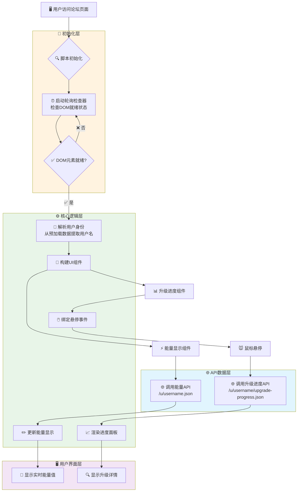
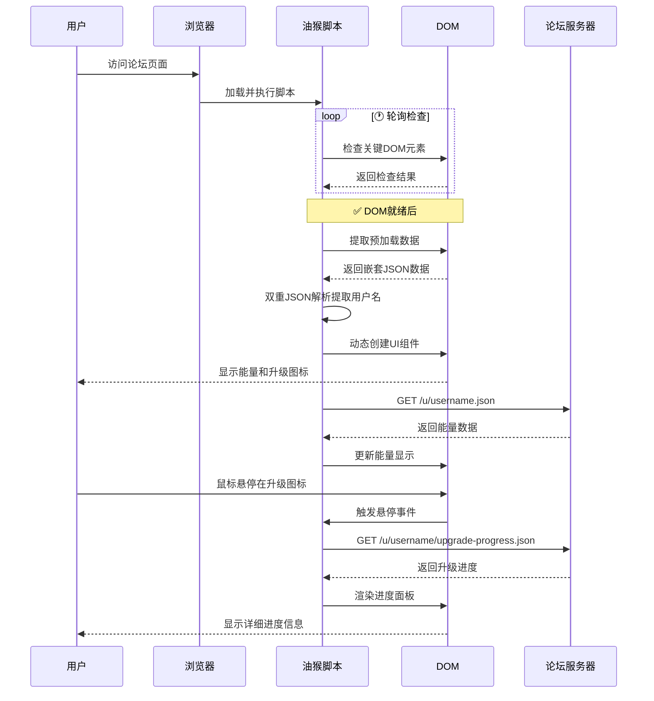
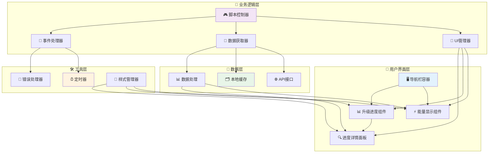

# NL 社区能量 & 升级进度显示脚本 🚀

[](https://opensource.org/licenses/Apache-2.0)
[](https://github.com/lza6/NL-Community-Energy-Upgrade-Progress/blob/main/NL.js)
[-orange.svg)](https://github.com/lza6)
[](https://greasyfork.org/zh-CN/scripts/545924-nl%E7%A4%BE%E5%8C%BA%E6%98%BE%E7%A4%BA%E8%83%BD%E9%87%8F%E5%92%8C%E5%8D%87%E7%BA%A7%E8%BF%9B%E5%BA%A6)

> ✨ "每一次刷新，都是对未知的探索；每一行代码，都是与未来的对话。这个脚本，献给在数字世界中不断追寻、渴望成长的你。"

这是一个为 [Nodeloc](https://www.nodeloc.com/) / [Linux.do](https://linux.do/) / [CloChat](https://clochat.com/) 等 Discourse 论坛深度用户打造的油猴脚本。它将你最关心的"能量值"和"升级进度"从层层菜单中解放出来，直接呈现在顶部导航栏，让你对自己的社区成长轨迹一目了然。

---

## 🌟 项目简介

在 `Nodeloc`、`Linux.do` 这样的知识型社区里，"能量"和"等级"不仅仅是数字，它们是你贡献、学习和交流的见证。但每次想查看这些信息，都需要繁琐地点击个人头像、进入个人主页，这个过程打断了我们沉浸式"水论坛"的流畅体验。

本脚本的核心使命就是：**消除信息壁垒，提供即时反馈，让你更专注于社区互动本身。**

## 🚀 主要特性

*   **⚡ 能量值实时显示**：在顶部导航栏直接展示你当前的能量分数，绿色数字，醒目清晰
*   **📊 升级进度可视化**：鼠标悬停在升级图标上，即可看到距离下一等级还需满足的条件和进度条
*   **🎨 无感集成**：UI 元素完美融入原生论坛风格，仿佛它本就该在那里
*   **🚀 轻量高效**：脚本逻辑清晰，仅在需要时发起请求，对浏览器性能影响微乎其微
*   **🔧 即装即用**：无需任何配置，安装脚本后刷新页面即可生效
*   **🌐 多站支持**：已适配 `Nodeloc`、`Linux.do`、`CloChat` 等多个热门 Discourse 论坛

## 🎯 解决了什么痛点？

想象一下，你刚刚发布了一个高质量的帖子，或者帮助别人解决了一个难题，你是不是很想立刻知道自己涨了多少"能量"？

*   **过去 🥱**：点击头像 → 点击用户名 → 进入个人资料页 → 寻找那个小小的数字
*   **现在 😎**：眼睛向上一瞥，搞定！

这个脚本带来的好处是显而易见的：

1.  **🎯 极致的便捷性**：将核心信息提升到最高优先级，减少无效点击，节省你的时间和精力
2.  **💫 即时的正向激励**：你的每一次贡献带来的能量增长都能被即时看到，维持社区参与热情
3.  **🎯 清晰的目标感**：升级进度条让你明确知道自己距离下一个等级还有多远
4.  **🌊 沉浸式体验**：你不再需要为了一个数字而跳出当前的阅读或编辑流程

**缺点？** 硬要说的话，可能就是它会让你更"沉迷"于提升能量和等级了！😉

# 使用效果：


---

## 🔧 懒人一键安装教程

别怕，整个过程比泡一杯咖啡还简单！

**第一步：安装脚本管理器**

你的浏览器默认不认识"油猴脚本"，需要一个"管家"来管理它们。最常用的就是 `Tampermonkey`（油猴）。

*   [Chrome 用户点这里安装](https://chrome.google.com/webstore/detail/tampermonkey/dhdgffkkebhmkfjojejmpbldmpobfkfo)
*   [Edge 用户点这里安装](https://microsoftedge.microsoft.com/addons/detail/tampermonkey/iikmkjmpaadaobahmlepeloendndfphd)
*   [Firefox 用户点这里安装](https://addons.mozilla.org/firefox/addon/tampermonkey/)
*   其他浏览器请在应用商店搜索 `Tampermonkey`

**第二步：安装本脚本**

点击下面的链接，你的"油猴管家"会自动弹出并询问你是否安装。

[](https://raw.githubusercontent.com/lza6/NL-Community-Energy-Upgrade-Progress/main/NL.user.js)

**第三步：享受吧！**

回到 [Nodeloc](https://www.nodeloc.com/) 或 [Linux.do](https://linux.do/) 网站，刷新一下页面。看看你的右上角，是不是多了点什么？🎉

---

## 🤔 它是如何工作的？

### 📖 大白话版：一个聪明的"情报员"

你可以把这个脚本想象成一个我们派驻到浏览器里的"情报员"🕵️‍♂️。

1.  **🕵️‍♂️ 耐心潜伏**：当你打开论坛页面时，这个情报员不会急着行动。它会每隔一小会儿就侦察一下，看看"导航栏"和"你的头像"这些关键地标是不是已经出现了
2.  **🔍 确认身份**：一旦地标出现，它会悄悄地翻看页面上一张隐藏的"预加载数据卡"，从上面找到你的"用户名"
3.  **📡 获取情报**：拿到你的用户名后，情报员会立刻动身，跑到论坛的"档案室"查询你的"能量档案"和"升级档案"
4.  **🎨 汇报工作**：拿到情报后，情报员会在导航栏上制作一个精美的"能量展示牌"和"升级进度按钮"
5.  **🔄 持续关注**：当你把鼠标放到能量值上时，它还会再去档案室确认一下最新数据

### 💻 开发者深度解析

> "代码是写给人看的，顺便让机器执行。" —— 这份代码正是这一哲学的践行者。

#### 1. 🎯 任务执行能力：等待与时机

*   **技术点**：`setInterval` + `MAX_ATTEMPTS`
*   **解释**：现代论坛是单页应用，页面内容动态生成。脚本使用轮询机制，每 500ms 检查关键元素是否就绪，同时设置最大尝试次数防止无限循环

#### 2. 🔍 核心逻辑：数据获取与解析

*   **技术点**：`document.getElementById('data-preloaded')` & `JSON.parse(JSON.parse(...))`
*   **解释**：从预加载数据中提取用户名需要两次 JSON 解析，这是脚本稳定运行的关键洞察

#### 3. 🎨 UI/UX 组件构建

*   **技术点**：`document.createElement`, `innerHTML`, `insertBefore`
*   **解释**：动态创建 UI 元素并精确插入到导航栏中，完美融入原生界面

#### 4. ⚡ 异步交互与数据更新

*   **技术点**：`fetch`, `Promise`, 错误处理
*   **解释**：使用异步请求获取数据，不阻塞页面，同时提供优雅的错误处理

---

## 🏗️ 项目架构

### 系统架构图



### 数据流程图



### 组件交互图



## 📁 项目结构

```
NL-Community-Energy-Upgrade-Progress/
├── 📄 NL.js                    # 核心脚本文件
├── 📖 README.md                # 项目文档
├── ⚖️ LICENSE                  # Apache 2.0 许可证
└── 🎨 assets/                  # 资源文件
    ├── 📸 screenshots/         # 效果截图
    │   ├── demo-before.gif     # 使用前效果
    │   └── demo-after.gif      # 使用后效果
    └── 🎯 icons/               # 图标资源
        ├── energy.svg          # 能量图标
        └── upgrade.svg         # 升级图标
```

---

## 🗺️ 发展蓝图

### ✅ 已实现功能

*   **🎯 核心功能闭环**：能量值显示 + 升级进度查看
*   **🛡️ 稳健初始化**：轮询机制适应各种网络环境
*   **🎨 优雅UI集成**：完美融入原生界面
*   **🔍 关键数据解析**：攻克嵌套JSON解析难题

### 🚧 当前局限

1.  **🔗 硬编码选择器**：依赖固定的CSS类名
2.  **⚙️ 无用户配置**：无法自定义显示选项
3.  **❌ 错误反馈不足**：API失败时用户体验不佳
4.  **💾 数据未缓存**：重复请求相同数据

### 🚀 未来规划

#### 1. 🎛️ 设置面板
```javascript
// 技术路径：GM_registerMenuCommand + GM_setValue
GM_registerMenuCommand('脚本设置', () => {
    // 弹出配置面板
    showSettingsPanel();
});
```

#### 2. 💾 智能缓存
```javascript
// 技术路径：localStorage + 时间戳
const cacheData = {
    data: apiResponse,
    timestamp: Date.now(),
    ttl: 300000 // 5分钟缓存
};
```

#### 3. ✨ 视觉反馈
```css
@keyframes energyPulse {
    0% { transform: scale(1); }
    50% { transform: scale(1.1); color: #4CAF50; }
    100% { transform: scale(1); }
}
```

#### 4. 🌐 多平台适配
```javascript
const siteConfigs = {
    'nodeloc.com': { selector: '.d-header-icons' },
    'linux.do': { selector: '.header-icons' },
    'clochat.com': { selector: '.nav-icons' }
};
```

### 🛠️ 技术栈评级

| 技术点 | 实现思路 | 难度 | 改进空间 |
|--------|----------|------|----------|
| **SPA延迟执行** | `setInterval`轮询 | ★★★☆☆ | **★★★★☆** 使用`MutationObserver` |
| **嵌套JSON解析** | 双重`JSON.parse` | ★★☆☆☆ | **★★☆☆☆** 已是最佳实践 |
| **动态UI注入** | `createElement` + `insertBefore` | ★★☆☆☆ | **★★★★☆** 微前端组件化 |
| **异步数据获取** | `fetch` + Promise | ★★★☆☆ | **★★★★☆** 封装通用apiClient |

---

## 📜 开源协议

本项目遵循 **Apache License 2.0** 开源协议。

你可以自由地使用、修改、分发本项目的代码，无论是商业还是非商业用途，但需要：
1. 保留原始的版权和许可声明
2. 说明你对文件所做的更改

## 🙏 致谢

*   **IWLZ**：项目的原始创作者
*   **所有 Discourse 社区的贡献者**：你们创造了这些充满活力的知识家园
*   **每一位使用者和反馈者**：你们的每一次使用，都是对这个项目最好的认可

---

> 💡 **最后的思考**：我们不仅仅是在写一个脚本，我们是在为自己的数字生活，打造一把更称手的"瑞士军刀"。愿你在信息的海洋中，航行得更远，也更快乐。如果你有任何想法，不要犹豫，Fork it, Change it, Push it! 开源的世界因你而精彩。

<div align="center">

**⭐ 如果这个项目对你有帮助，请给它一个 Star！** 

*让更多人发现这个实用的工具* ✨

</div>
